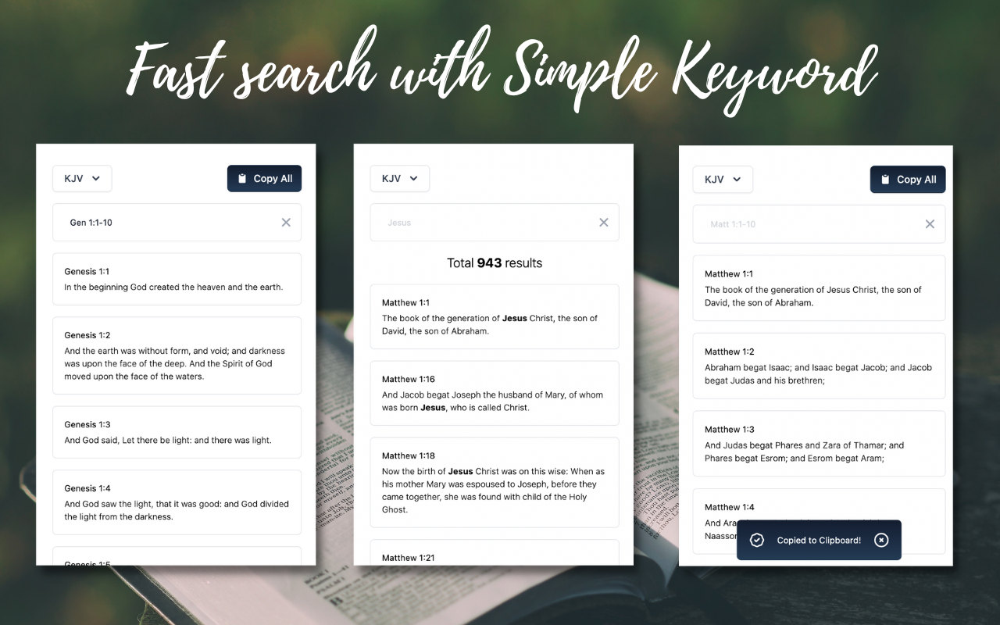

# Bible Project

Welcome to the Bible project! The goal of this project is providing highly accessible Bible applications for public. (Acts 1:8)

# Support Languages & Versions
- English
    - KJV (King James Version)
    - NIV (New International Version)
- Korean
    - 개역개정 (New Korean Revised Version)
    - 개역한글

# Features

You can try out the features of searching and copy/paste in your apps:

### Search
- With Book abbreviations: 

<i>Ex) Gen 1:1, gen 1:1-10 </i>

This will show the results of single verse (1:1) or multiple verses(1:1-10) of the `Genesis`.

- With specific keywords:

<i>Ex) Abraham, salvation </i>

This will show the results of all the verses including `Abraham` or `salvation`.

### Copy/Paste

You can easily copy each verse or whole results to your clipboard.

# Download

- [Chrome Extension](https://chromewebstore.google.com/detail/bible-search/lcimelgcehidimkkleiknejjiicieekb)

# Feedback 
We'd love to hear your thoughts and see your experiments, so come and say hi on [Discord](https://discord.gg/3auWcCN9)

# Contributing

See [CONTRIBUTING.md](./CONTRIBUTING.md) for more info and guidance on how to run the project.

# License

The Bible Project is licensed under the
[MIT](https://choosealicense.com/licenses/mit/).